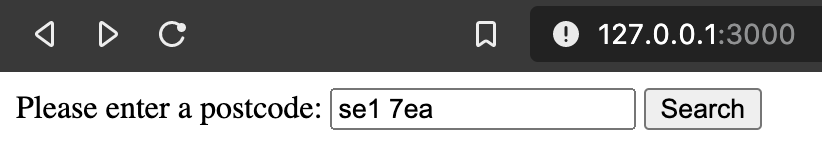

# README

This README would normally document whatever steps are necessary to get the
application up and running.

Things you may want to cover:

* Ruby version

2.7.1

* System dependencies

* Configuration

bundle install

* How to run the test suite

rails t

* Services (job queues, cache servers, search engines, etc.)

* Deployment instructions

To run

*rails s*

open a browser on http://127.0.0.1:3000

Enter a postcode and click **Search**

